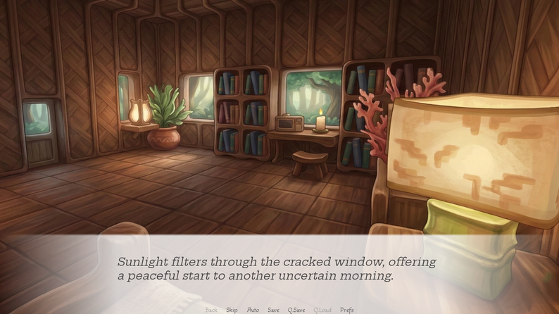
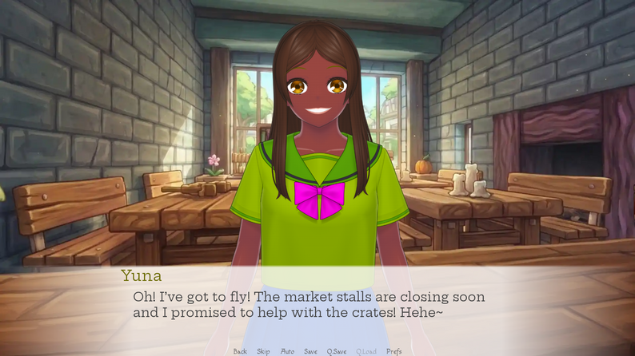
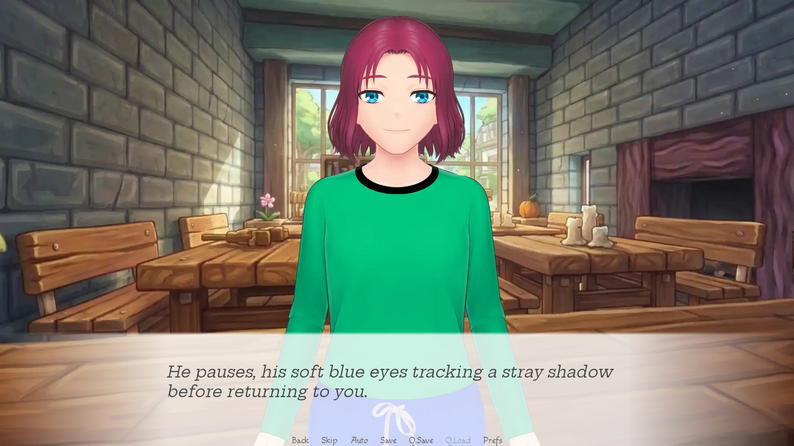
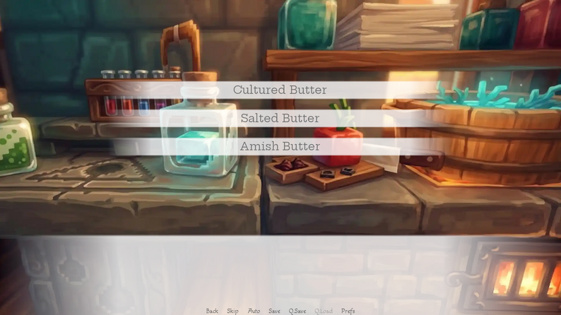

# As You Are | Project Repository

Welcome to the official repository for **As You Are**, a cozy visual novel by **CuteSense Studios**.

> [!CAUTION]
> **Technical Status**: This repository contains **outdated template code** and serves as a technical reference for the game’s structure. It does not represent the final, polished release of the narrative or assets.

---

## ☕ About the Game

*As You Are* is a place where every cup tells a story and every bond is brewed to perfection. Manage unique flavors, build lasting relationships with customers like **Yuna** and **Dalvana**, and find your place in the cafe's daily symphony.

Whether you’re perfecting a signature flavor profile or navigating the personal stories of regulars, your choices help define the heart of the cafe.

### **Key Features**

* **Deep Character Bonding**: Influence relationships through meaningful dialogue.
* **Cafe Management**: Balance the "symphony" of the cafe by managing flavors and atmosphere.
* **Immersive Atmosphere**: Curated AI-assisted visuals and soundscapes.
* **A Personal Debut**: The first official release from CuteSense Studios, built with a focus on storytelling.

### **Screenshots**

Local screenshots are supported in this repository. The project already contains example screenshots; they are displayed below.

### **Screenshots Showcase**

  <figure style="display:inline-block; margin:8px; text-align:center;">
    
    <figcaption>Main menu</figcaption>
  </figure>
  <figure style="display:inline-block; margin:8px; text-align:center;">
    
    <figcaption>In-game scene</figcaption>
  </figure>
  <figure style="display:inline-block; margin:8px; text-align:center;">
    
    <figcaption>Character close-up</figcaption>
  </figure>
  <figure style="display:inline-block; margin:8px; text-align:center;">
    
    <figcaption>Pause/menu overlay</figcaption>
  </figure>

## 🚀 Releases

You can find stable builds and version history on the [Releases Page](../../releases) once they become available.

---

## 🛠️ Technical Details

This repository is built using the **Ren'Py Visual Novel Engine**.

* **Structure**: Standard Ren'Py project directory.
* **Code State**: Outdated/Template.
* **Purpose**: This repo is maintained for version history and technical scaffolding.

### **Setup (For Development Reference)**

To view or run this template code:

1. Download the [Ren&#39;Py Launcher](https://www.renpy.org/).
2. Clone this repository into your Ren'Py projects directory.
3. Open the project via the Launcher to browse the scripts (`.rpy` files).

---

## 📝 Developer’s Note

> "This is my very first game! It’s a labor of love, and while there may be a few 'hiccups' along the way, I’ve poured my creativity into making this a memorable experience. To help bring my vision to life as a solo dev, I’ve utilized AI assets for image generation, select audio, and text refinement. I hope you enjoy your stay at the cafe!"
>
> — **Crossie**

---

### ⚖️ License & Credits

* **Engine:** [Ren&#39;Py](https://www.renpy.org/)
* **Studio** : **CuteSense Studios**
* **Developer** : Crossie

### 🎨 Visual Arts

To maintain a consistent aesthetic as a solo developer, the following tools were utilized:

* **Environments & Backgrounds** : Artistically directed and generated via **Nano Banana 2** (Gemini 3 Flash Image).
* **Character Art** : Designed using  **Mannequin Character Generator** .

### 🎵 Audio & Sound

* **Music** : Ambient tracks and scores composed via  **Suno AI** .
* **Sound Effects** : High-quality SFX sourced from  **Pixabay** .

### ✍️ Narrative & Text

* **Story & Writing** : Original narrative by **Crossie**.
*  *Note: This work was co-authored by human imagination and artificial intelligence.*
* **Dialogue Refinement** : Narrative pacing and dialogue polished with assistance from  **Gemini 3 Flash** .

### 🤖 Technical Stack & AI Integration
Several game assets and core components were developed using a hybrid AI workflow:

* **Cursor AI**: Utilized in Auto Mode for rapid code generation and asset management.
* **Claude 3.5 Sonnet (Thinking)**: Leveraged within the Google Project IDX (or Antigravity) environment for advanced logic and architectural design.
  
  ---

  *Created with Gemini, Human-Verified*
